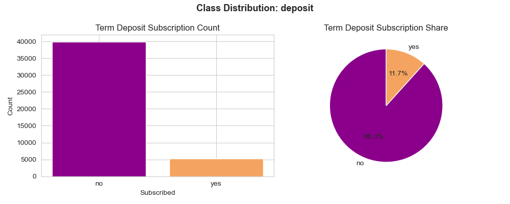
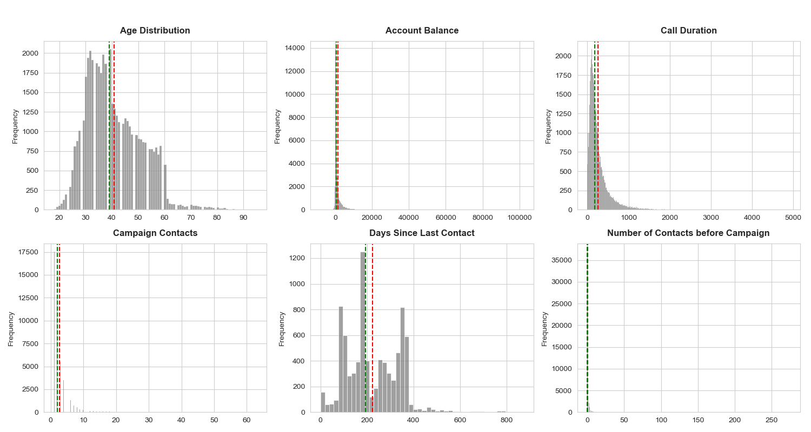
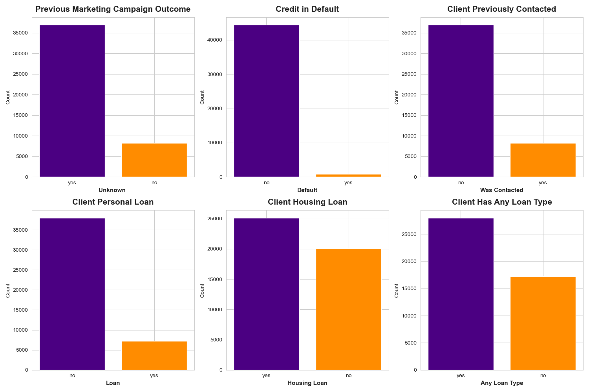
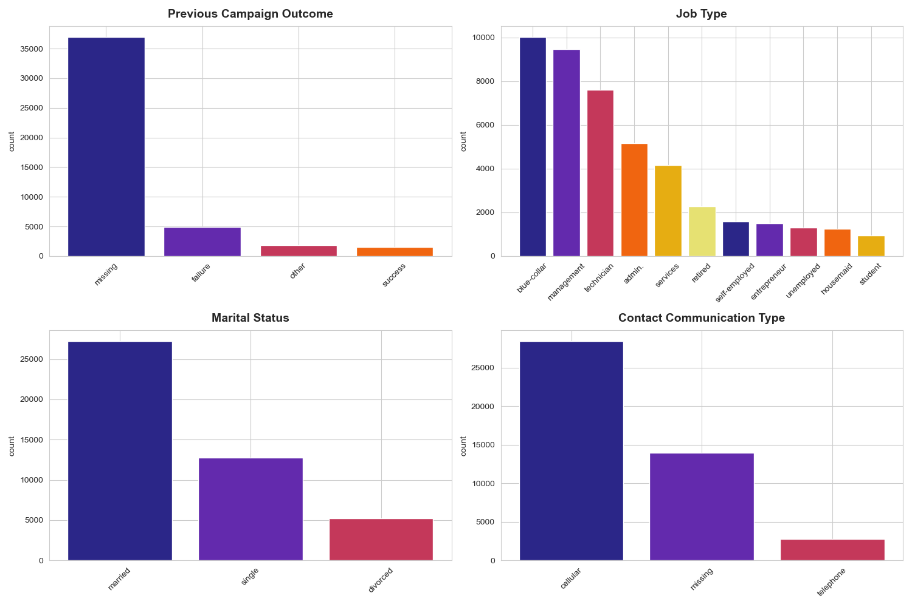
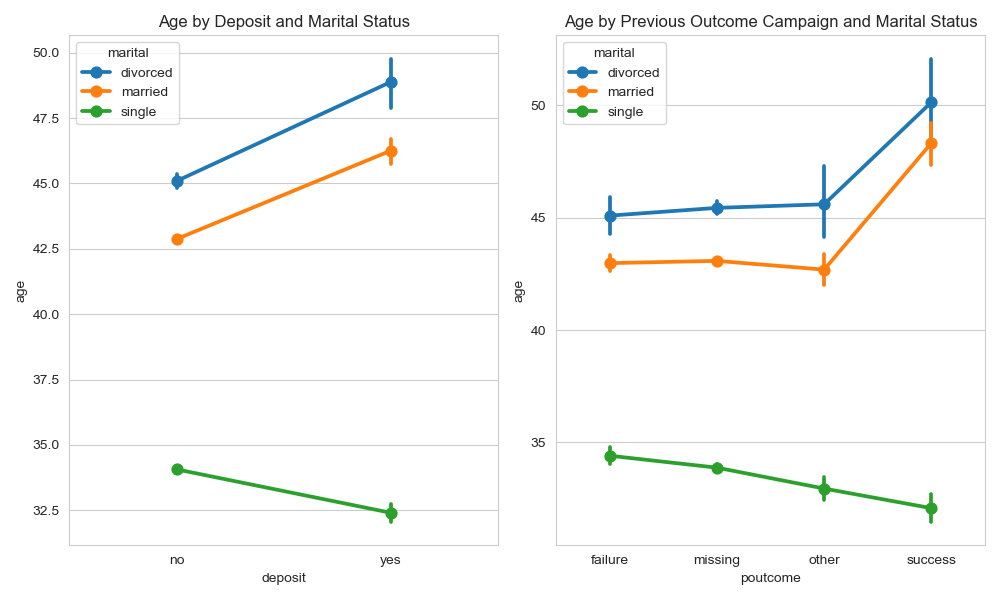
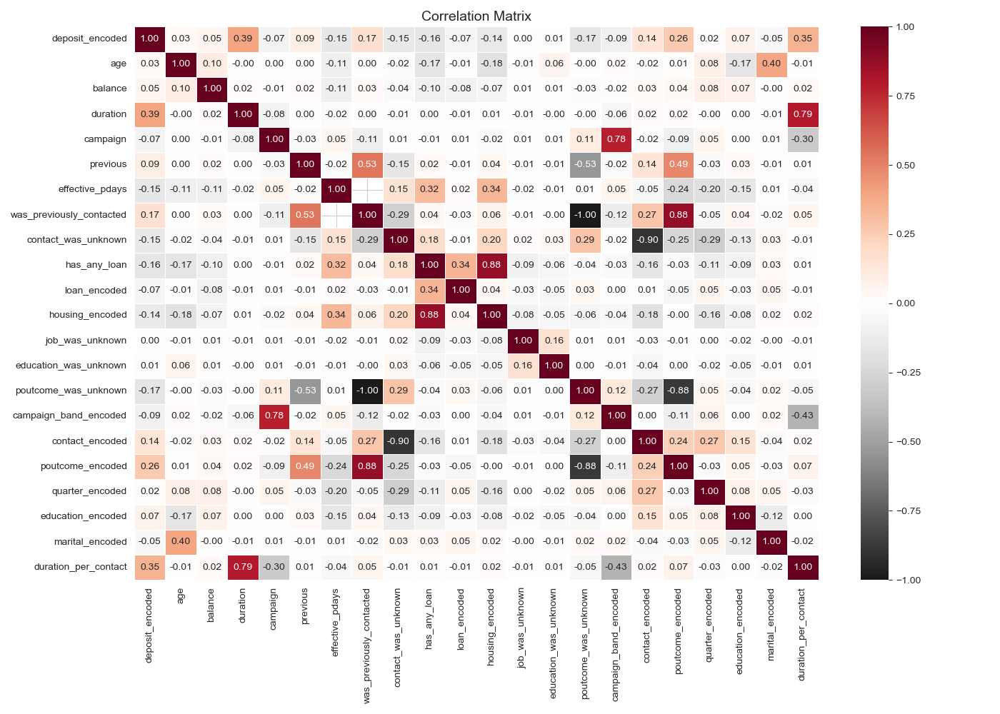

## Overall EDA Findings

### Overview

This project explores client data from a bank marketing campaign to understand the factors that influence whether a customer subscribes to a **term deposit**. A **term deposit** is a financial product that requires placing funds into a fixed-term account for specified period in exchange for guaranteed interest.

The focus of the exploratory data analysis is to understand data patterns and uncover insights to guide feature selection by: 

- Understanding feature distributions
- Identifying patterns and relationships
- Detecting data quality issues
- Highlighting key predictors for modeling

### Target Variable

Binary variable: `deposit` 
- Yes -> Client subscribed to a term deposit
- No -> Client did not subscribe

#### Key Insight
`deposit`  is highly imbalanced

| **Class** | **Count** | **Percentage** |
| --------- | --------- | -------------- |
| No        | 39,922    | 88.3%          |
| Yes       | 5,289     | 11.7%          |

---

### Numerical Variables Distribution

#### Key Insights

- `age`: Roughly normally distributed with a slight right skew toward older ages, however, most clients fall between 25 and 60 years old.
	- Mean: 41 | Median: 39
	- Majority between 25–60

- `balance`: Strongly right-skewed with extreme outliers ranging from $-8,019 €$ to $102,127 €$
	- Most clients have low balances, with a few extreme high values
	- Mean: $1,362 €$ | Median: $448 €$

- `duration`: Most calls are short, with a median of about 3 minutes, but some last about 80 minutes
	- Highly right-skewed
	- Mean ≈ 258 seconds | Median ≈ 180 seconds
	- Long tail up to ≈ 4,918 seconds

- `campaign`:
	- Most clients contacted **1–3 times**
	- Extreme cases up to **63 contacts**

- `previous`: Most clients had never been contacted before the current campaign
	- Highly skewed
	- small number of clients contacted up to **250 times**

- `effective_pdays`:  Transformed feature derived from `pday`. Multimodal distribution with spikes around 100, 200, and 400 days
	- `NaNs` if never contacted

---

### Binary Variables

#### Key Insights

- Most clients were never previously contacted
	- `was_previously_contacted` and `poutcome_was_unknown` are  inversely correlated. Before modeling, one of these variables should be dropped to eliminate redundancy.
- `default` variable is extremely imbalanced (<2%)
	- Low predictive value
- `housing_loan` is well-balanced, which makes it a strong feature for modeling.
- `has_any_loan` is a balanced derived feature that will make a valuable contribution to the model.

---

### Categorical Variables

#### Key Insights 

- **Previous Campaign Outcome**:
	- Majority missing
	- Minority **success** class can offer valuable insights.

- **Job Type**:
	- Largest groups: blue-collar, management, technician
	- Smaller but important groups: retired, student, self-employed

- **Marital Status**:
	- Well distributed across married, single, and divorced

- **Contact Type**:
	- Cellular most common
	- A large portion of missing values

- **Education**:
	- Secondary most common
	- Followed by tertiary and primary

- **Age Groups (Life Stages)**:
	- Majority between **26–50**

- **Contact Frequency**:
	- Most clients contacted between 1 to 3 times
	- Hypothesis: higher contact frequency -> lower success

---

### Bivariate & Multivariate Patterns

#### Point Plots Key Insights 

**Age by Marital Status, Deposit and Previous Outcome**

- Older individuals, especially married/divorced, are more likely to subscribe
- Possible interaction predictor between **age and marital status**: older married and divorced clients subscribe at notably higher rates than younger single clients.

Clients aged 65+ have the highest subscription rates across all marital status, education, and job categories. The 26–51 age group consistently show the lowest subscription rates, possibly reflecting financial commitments such as mortgages and dependents.

**Age and Education**

- Strong effect for **primary education**: Subscribers are significantly older than non-subscribers
- Minimal effect for higher education groups

Clients with secondary and tertiary education are both clustered around age 40, with only a slight increase among subscribers. This indicates that age has little effect on highly educated clients, however,  older age is strongly associated with subscription among clients with primary education. A similar pattern is observed with a previously succesful campaign. 
 

**Call duration and subscription:**  

Across all demographic groups, non-subscribers show nearly identical call durations, approximately 3 minutes, while subscribers consistently have much longer calls, 8 to 10 minutes. The inclusion of this variable may lead to signs of overfitting.

---
### Correlation Matrix Insights

**Strong Predictors**

- **Duration**: 0.39 likely biased and could lead to overfitting
- **Previous Outcome `poutcome`: 0.26
- **Contact Type**: 0.14
- **Days Since Contact `pdays`: -0.15

**Weak Linear Correlation**

-`age`, `balance`, `education`, `marital_status`

Note: interaction terms between these features may be included

---

### Heatmaps Insights 

**Age-Based Patterns**

- **65+ clients** consistently show the highest subscription rates, as indicated by  brighter colors. This trend remains consistent across different marital status and education levels, indicating that age is the main factor influencing this group.

- **26–50 group**:
  - Largest segment
  - Lowest conversion rates

**Campaign Contact Frequency** 
- Higher contact frequency means lower subscription rates
- Best results occur with **single contact**

**Job-Based Insights**
- Highest subscription rate:
  - **Retired**
  - **Students**

**Campaign contact fatigue:** 

- Subscription rates decline rapidly as the number of campaign contacts increases, regardless  of marital status, education, or age group.  
Clients contacted only once show the highest subscription rates across all demographic segments. Those contacted 7+ times show the lowest subscription rates, suggesting that repeated contact is either ineffective or counterproductive.

**Previous Campaign Outcome by Age and Education:**  

A prior successful campaign outcome is a strong and consistent predictor. The effect persists across all combinations of marital status and education, with subscription rates of approximately 61 to 66%. 

---

## Tech Stack

•	Python
•	Pandas
•	NumPy
•	Matplotlib
•	Seaborn
•	Scikit-learn

